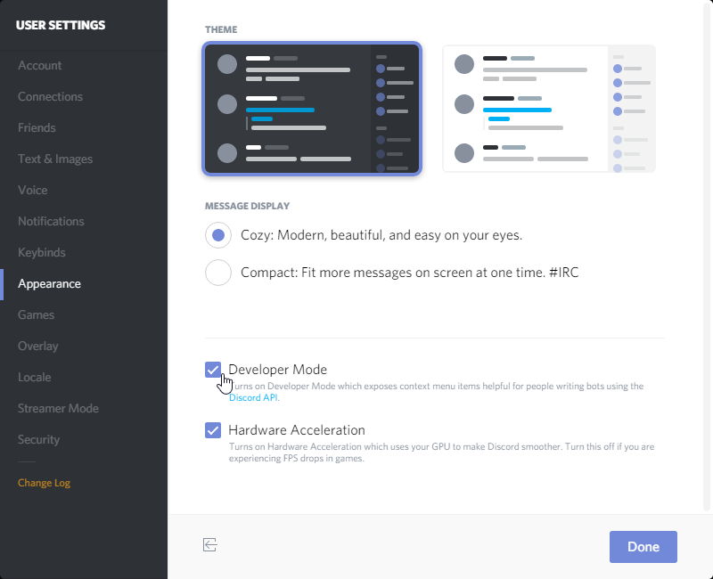
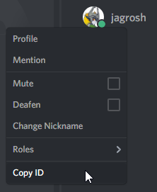

此頁面描述了如何查找您的唯一用戶 ID。任何一種方法都可以使用，您只需選擇其中一種即可。

## 方法 1
1. 像要提及（@）自己一樣輸入文本。（確保您只提及自己而不是其他人） 
2. 在提及符號前加上一個反斜杠（`\`） 
3. 發送訊息。顯示的將是您的 ID，左右分別被 `<@` 或 `<@!` 和 `>` 符號包圍（訊息應該被高亮） 
4. 複製 _僅_ 數字部分；其他符號不是您用戶 ID 的一部分 

## 方法 2
1. 點擊用戶設定按鈕 
2. 在*外觀*標籤中，勾選*開發者模式*選項 
3. 在成員列表中右鍵點擊您的用戶名，然後選擇*複製 ID* 
