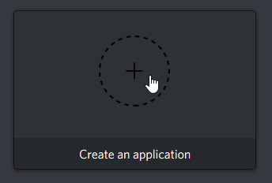
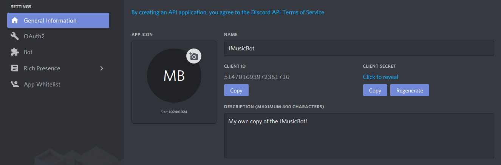
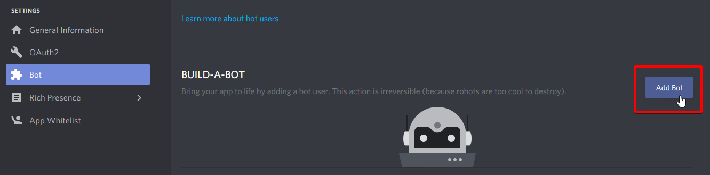
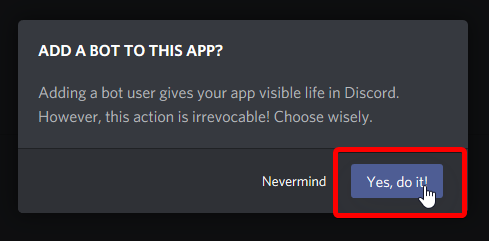
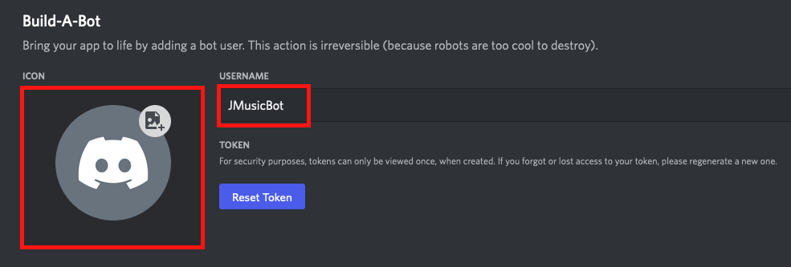
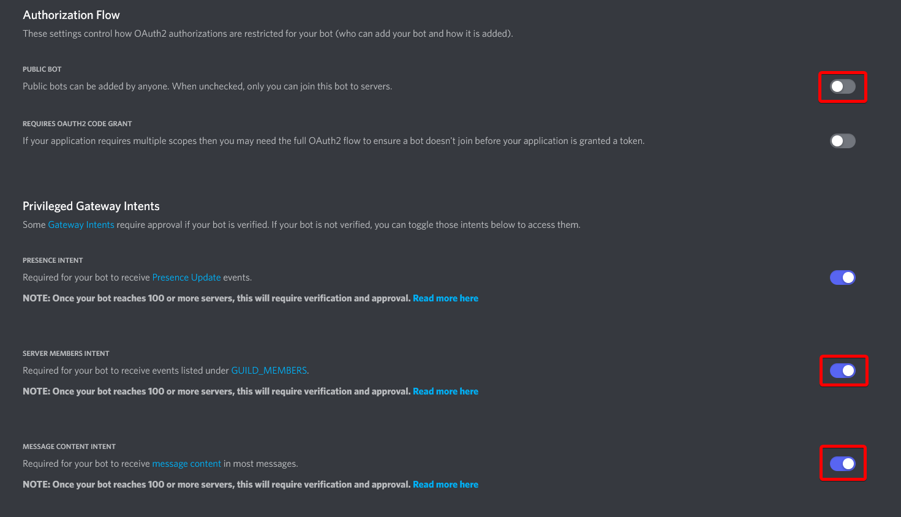
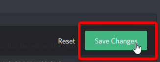
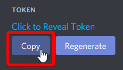

此頁面將詳細描述如何為您的音樂機器人獲取 token。

1. 前往您的 [應用程序頁面](https://discordapp.com/login?redirect_to=/developers/applications)（您可能需要先登錄）

2. 點擊*創建應用程序*按鈕  

3. 在 **General Information** 標籤中，設置一個名稱以識別您的應用程序（這不是機器人的名稱）  

4. 前往 **Bot** 標籤並選擇 **Add Bot**  

5. 點擊*Yes, do it!*  

6. 設置名稱和頭像（可選）  

7. 取消勾選 **Public Bot**（可選），並勾選 **Message Content Intent** 和 **Server Members Intents**  

    !!! warning
        JMusicBot 並非設計為公共音樂機器人，建議別對外開放。

8. 保存您的設置  

9. 在 token 部分選擇 **Copy** 按鈕，將機器人的 token 複製到剪貼板。  

