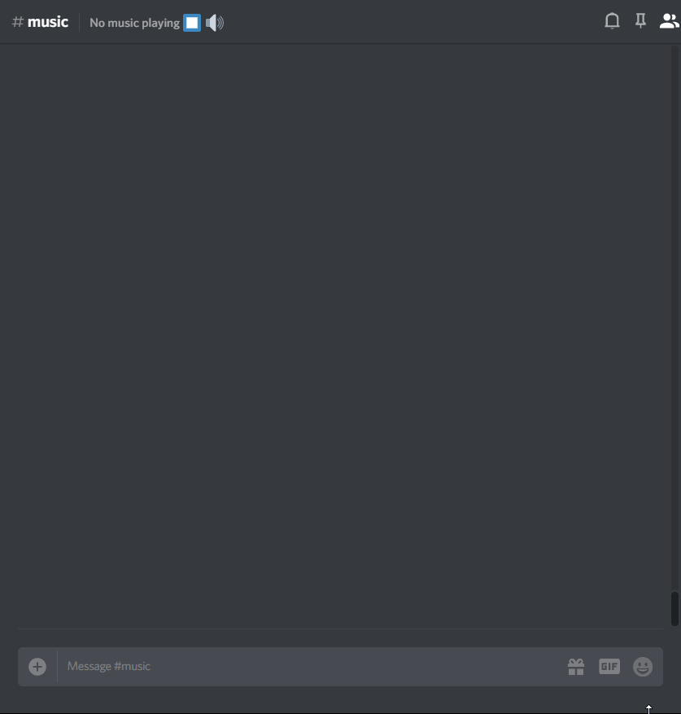

## 歡迎來到 **JMusicBot** 維基！

[🔢 設置](setup.md){ .md-button }
[⏰ 24/7 託管](hosting.md){ .md-button } 
[📃 播放清單](playlists.md){ .md-button } 
[📜 完整指令參考](commands.md){ .md-button } 
[⚠ 故障排除](troubleshooting.md){ .md-button } 
[📥 支援伺服器](https://discord.gg/0p9LSGoRLu6Pet0k){ .md-button }
  

## 功能
  * 簡單運行（確保安裝了 Java，然後運行即可！）
  * 快速加載歌曲
  * 無需額外密鑰（除了 Discord 機器人令牌）
  * 平滑的播放體驗
  * 特定伺服器設置「DJ」角色來管理音樂
  * 乾淨美觀的菜單
  * 支援多個網站，包括 YouTube、Soundcloud 等
  * 支援在線電台/串流
  * 支援本地文件
  * 支援播放清單（包括網絡/YouTube 和本地清單）

## 支援的來源與格式
JMusicBot 支援 [lavaplayer](https://github.com/sedmelluq/lavaplayer#supported-formats) 所支援的所有來源與格式：
### 來源
  * YouTube
  * SoundCloud
  * Bandcamp
  * Vimeo
  * Twitch 串流
  * 本地文件
  * HTTP URL
### 格式
  * MP3
  * FLAC
  * WAV
  * Matroska/WebM (AAC、Opus 或 Vorbis 編解碼器)
  * MP4/M4A (AAC 編解碼器)
  * OGG 串流 (Opus、Vorbis 和 FLAC 編解碼器)
  * AAC 串流
  * 串流播放清單 (M3U 和 PLS)

## 範例

## 設置
請參閱維基中的 [設置頁面](setup.md) 來自行運行此機器人！
